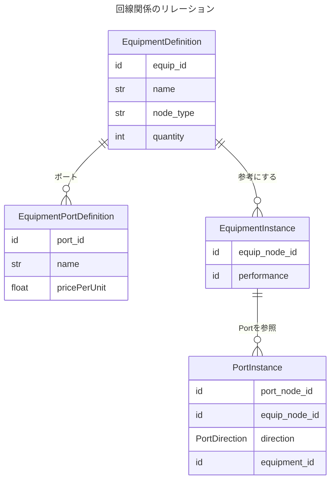
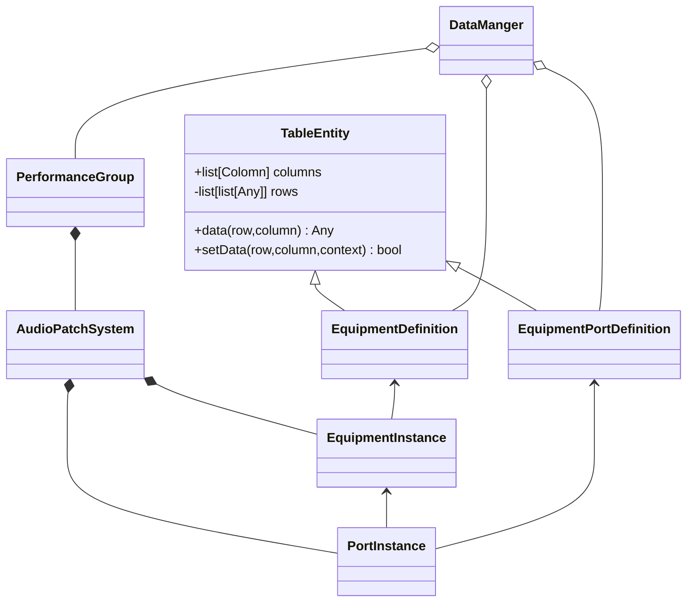

# Entity一覧
- Preset
	- EquipmentEntity(あくまでも機器の設定であって個別を表さない)
	- EquipmentPortEntity(EquipmentEntityに複数持つことができる)
- Project
	- ProjectDataEntity
	- PerformanceDataEntity(コチラは日程ごとに保持する)
- LineGraph
	- Equipment(ライブで使われる個々の機器)
	- EquipmentPort

# クラス実装

